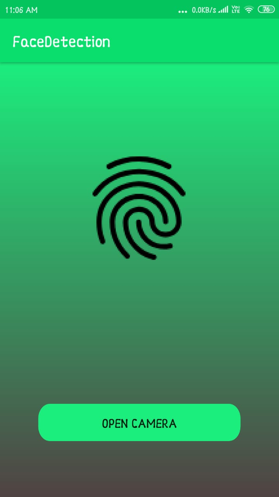
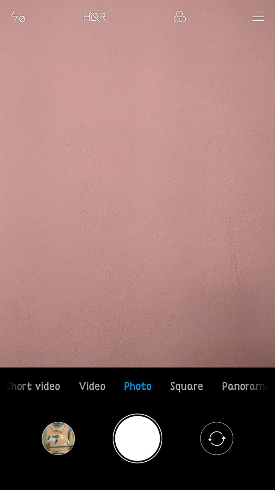
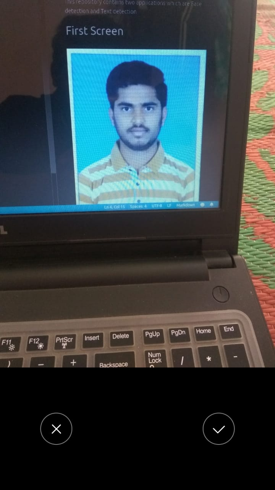
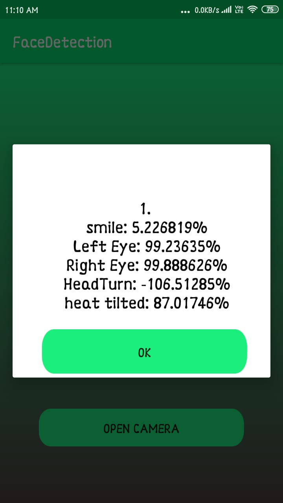

# ML-kit-Project
This repository contains two applications which are Face detection and Text detection
# FACE DETECTION APP
**when you open the app in the mobile it will open the home screen.**
## Home Screen

**There is a Button With the name open camera  if you click the Button the Camera will open**

## Camera Screen

 **Next we have to take pictires using camera**

## Image Screen

**if it is not detecting any face in the image it will display the below screen**

## No face detection Screen

**the image with human face**
## face detection Screen

**if it detects any face in the image it will give the result like below screen**

## Result Screen

**if you click the OK button the home screen will display**

