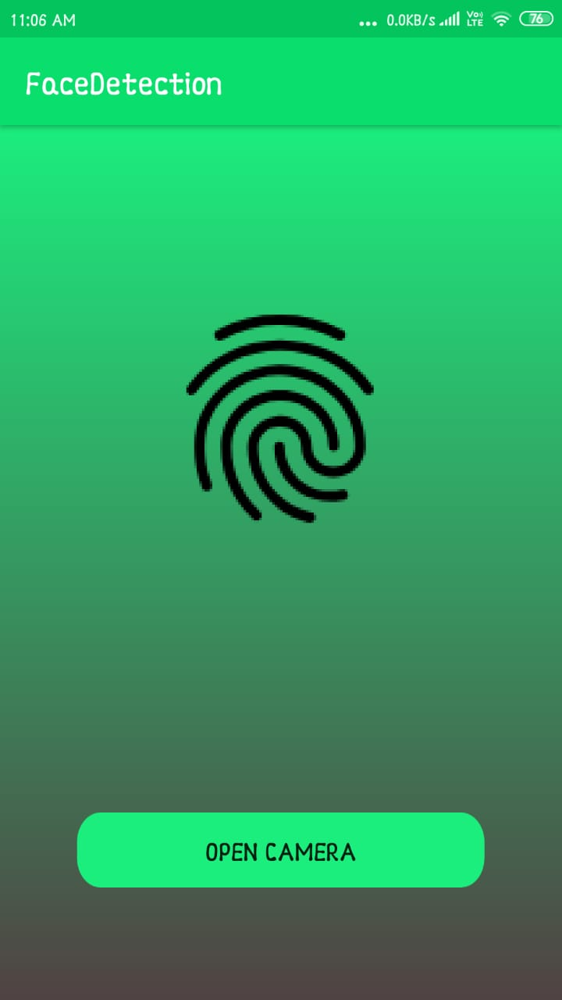
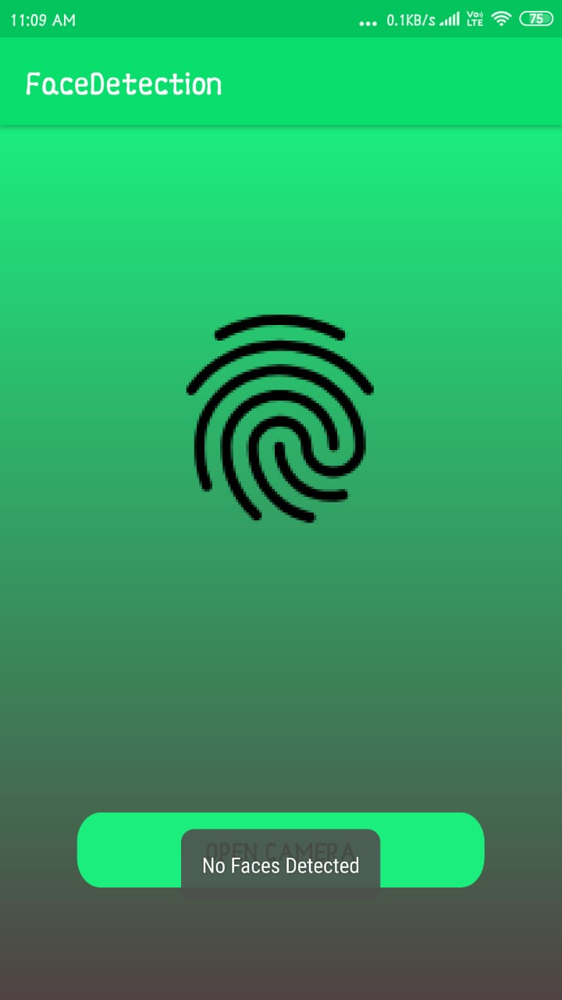
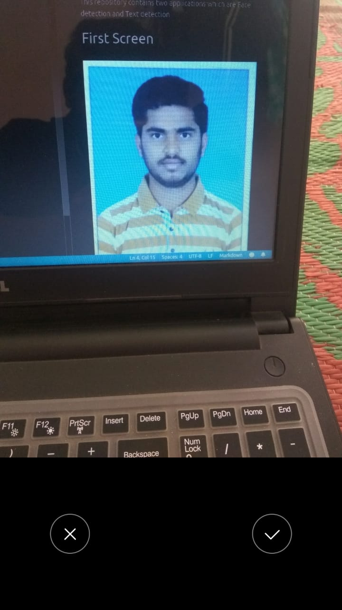
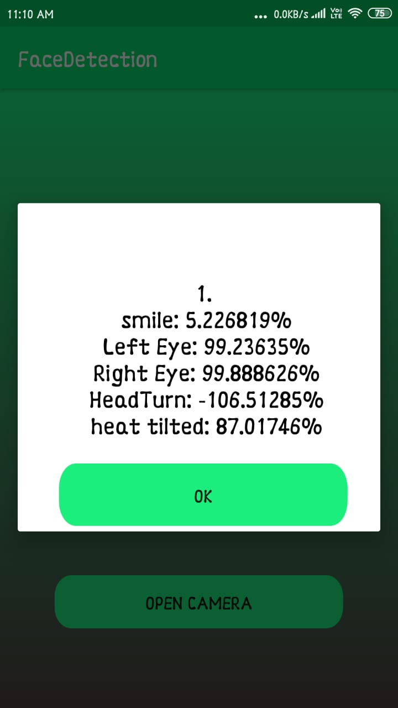

# ML-kit-Project
This repository contains two applications which are Face detection and Text detection
# FACE DETECTION APP

By using this app we can captures the images, and it tell us weather it is human face or not , If it is human face it gives some result to us otherwise it says no face detected.

**when you open the app in the mobile the home screen will appear.**

 Home Screen | Camera Screen | Image Screen 
 :-------:|:----------:|:----------:|
 |  |  | 
There is a Button With the name open camera if you click the Button the Camera will open| Next we have to take pictires using camera | if it is not detecting any face in  the image it will display the below screen |

 No face detection Screen | face detection Screen | Result Screen
 :---------:|:-----------:|:-------------:
  |  | 
  the image with human face | If it detects any face in the image it will  give the result like below screen | if you click the OK button the home  screen will display

## Technology Stack

1. [Android Framework](https://codelabs.developers.google.com/android-training/) to build android mobile apps, it gives the guidance on android app development
2. [Java Language]() to write code for android apps
3. [Firebase](https://firebase.google.com/) it gives lot of features to our app. like storage,database,push notification etc..
4. [android studio](https://developer.android.com/studio) IDE to write and test the code for apps